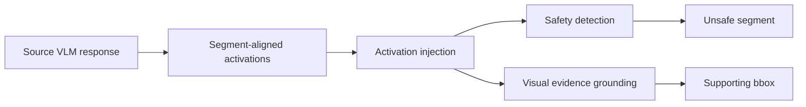

# Activation Revelation

### Tracing Vision-Language Models Vulnerabilities via Internal Activations

[](#setup)
[](LICENSE)
[](examples)

**Activation Revelation (AR)** is an activation-conditioned framework for fine-grained multimodal safety auditing. It traces localized safety risks in vision-language model responses by detecting unsafe response segments and grounding the image regions that support those risks.

> This codebase is built on and adapted from Adam Karvonen's [Activation Oracles](https://github.com/adamkarvonen/activation_oracles). The upstream MIT license notice is preserved in [LICENSE](LICENSE), with additional attribution in [NOTICE](NOTICE).

## What AR Does



AR has two executable paths:

| Path | Goal | Main output |
| --- | --- | --- |
| `detection/` | Segment-level safety detection from internal activations | `safe` / `unsafe` predictions and safety metrics |
| `explanation/` | Activation-conditioned bbox abduction for unsafe segments | Bounding-box predictions and IoU-threshold metrics |

## Paper Abstract

Vision-language models (VLMs) are powerful and already perform well in scenarios such as interpreting images, answering visually grounded questions, and generating long-form responses. However, because their responses are complex, open-ended, and multimodal, they can contain localized safety risks that are hard to trace. Identifying which response segment is unsafe and which image region supports the risk defines the task of fine-grained multimodal safety auditing.

Existing safety detection and grounding methods still perform poorly on this task, showing that it remains highly challenging. To this end, we propose **Activation Revelation (AR)**, the first activation-conditioned framework for jointly detecting segment-level safety risks and grounding their visual evidence. AR extracts segment-aligned internal activations from the source model and injects them into a downstream large language model for precise risk detection and visual evidence grounding.

To support this paradigm, we introduce the Answer-to-Region Grounding of Unsafe Segments (ARGUS) dataset and upgrade existing benchmarks with detailed segment and bounding-box annotations. Extensive experiments demonstrate that our framework significantly outperforms strong safety and grounding baselines, achieving a 7.2% gain in overall detection Macro-F1 and a 26.9% gain in ACC@0.5 visual evidence grounding. More importantly, it provides actionable risk segments and visual evidence for real VLM safety auditing, supporting safer and more transparent multimodal AI systems.

## Repository Map

```text
detection/      Safety detection trainer, evaluator, metrics, and PT converter
explanation/    Bbox abduction trainer, evaluator, metrics, and PT converter
scripts/        Small runnable entry points
examples/       Tiny SPA-VL-derived examples for smoke testing
```

The scripts consume prebuilt `.pt` activation-oracle datasets. The converters are included for rebuilding those `.pt` files from the project CSV schemas.

## Setup

Use Python 3.10 or newer.

```bash
pip install -r requirements.txt
```

For large full-parameter runs, use multiple GPUs and DeepSpeed. For quick smoke tests, set `MAX_STEPS=1`, `MAX_TRAIN_EXAMPLES`, `MAX_EVAL_EXAMPLES`, or `MAX_EXAMPLES`.

`flash-attn` is optional. If it is unavailable, the model loaders fall back to PyTorch SDPA.

## Quick Check

The repository includes tiny SPA-VL-derived CSVs, images, and sample prediction files. This check is CPU-only and validates the metric code paths without loading an 8B model:

```bash
bash scripts/verify_examples.sh
```

Expected outputs:

```text
outputs/example_verification/detection_metrics.json
outputs/example_verification/bbox_metrics.json
outputs/example_verification/bbox_per_sample.csv
```

The example rows and images are documented in [examples/README.md](examples/README.md) with CC BY 4.0 attribution and citation.

## Run Evaluation

Detection:

```bash
MODEL=/path/to/detection/final \
TEST_PT=/path/to/detection/test.pt \
SOURCE_CSV=/path/to/detection/test.csv \
NPROC_PER_NODE=4 \
bash scripts/evaluate_detection.sh
```

Outputs:

```text
outputs/detection_eval/predictions.csv
outputs/detection_eval/metrics.json
```

`SOURCE_CSV` is used to map PT `row_idx` values back to `dataset_A`, `dataset_B`, and `dataset_C` for grouped metrics.

Bbox abduction:

```bash
MODEL=/path/to/explanation/final \
TEST_PT=/path/to/explanation/test.pt \
NPROC_PER_NODE=4 \
bash scripts/evaluate_explanation.sh
```

Outputs:

```text
outputs/explanation_eval/predictions.csv
outputs/explanation_eval/bbox_metrics.json
outputs/explanation_eval/bbox_per_sample.csv
```

The bbox metrics report matching performance at IoU thresholds `0.1`, `0.3`, `0.5`, and `0.75`.

Already have a detection prediction CSV? Compute metrics without loading a model:

```bash
python detection/experiments/detection_metrics_from_csv.py \
  --predictions examples/spavl_detection_predictions.csv \
  --source-csv examples/spavl_detection.csv \
  --output-json outputs/example_detection_metrics.json
```

## Train AR

Detection:

```bash
BASE_MODEL=Qwen/Qwen3-8B \
TRAIN_PT=/path/to/detection/train.pt \
VAL_PT=/path/to/detection/val.pt \
SAVE_DIR=outputs/detection_model \
NPROC_PER_NODE=4 \
bash scripts/train_detection.sh
```

Bbox abduction:

```bash
BASE_MODEL=Qwen/Qwen3-VL-8B-Instruct \
TRAIN_PT=/path/to/explanation/train.pt \
VAL_PT=/path/to/explanation/val.pt \
SAVE_DIR=outputs/explanation_model \
NPROC_PER_NODE=4 \
bash scripts/train_explanation.sh
```

Default training settings mirror the final AR runs: `hook-layer=1`, `steering-mode=add`, full-parameter training (`USE_LORA=0`), and DeepSpeed enabled (`USE_DEEPSPEED=1`). The bbox abduction path additionally uses language-model-only VLM training, `image-max-pixels=100352`, and `max-seq-length=512`.

## Build PT Data

Detection:

```bash
INPUT_CSV=/path/to/detection/train.csv \
OUTPUT_PT=/path/to/detection/train.pt \
ACTIVATION_MODEL=Qwen/Qwen3-VL-8B-Instruct \
DATASET_ROOT=/data \
bash scripts/convert_detection_csv_to_pt.sh
```

Bbox abduction:

```bash
INPUT_CSV=/path/to/explanation/train.csv \
OUTPUT_PT=/path/to/explanation/train.pt \
ACTIVATION_MODEL=Qwen/Qwen3-VL-8B-Instruct \
bash scripts/convert_explanation_csv_to_pt.sh
```

Default PT extraction uses `model.language_model.layers.16`. Override with `LAYER_PATH=...` if you rebuild a different configuration.

## Maintainer

**Tiancheng** ([Tianchenggg](https://github.com/Tianchenggg))

